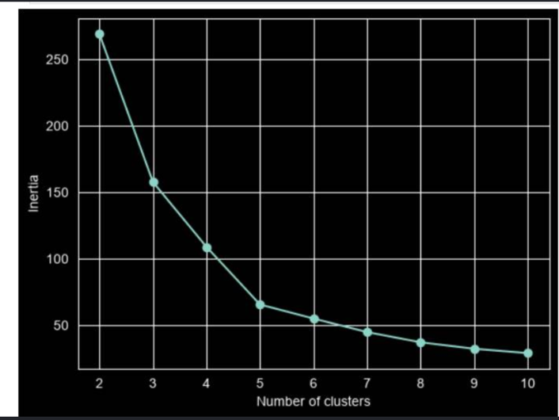
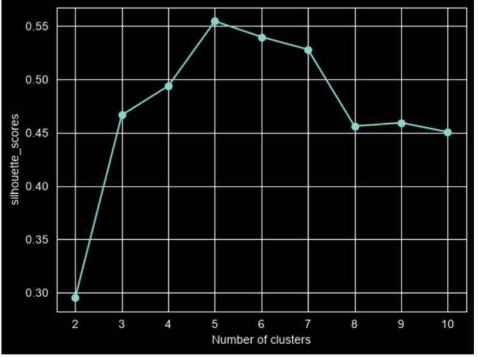
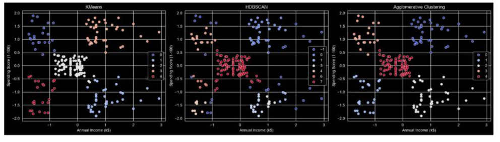
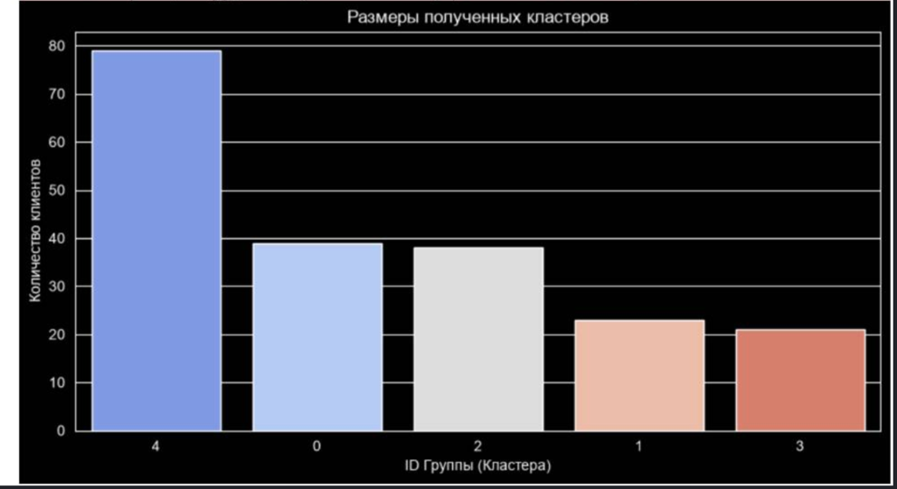

# Customer Segmentation Data Analysis 👥📈

Репозиторий содержит проект по **сегментации клиентов торгового центра** с использованием методов машинного обучения без учителя (кластеризации). Основная цель проекта — попрактиковаться в алгоритмах кластеризации, закрепить навыки построения сквозных пайплайнов данных и научиться извлекать полезные инсайты для бизнеса.

## 📊 Исходные данные
В проекте используется популярный датасет **Mall Customer Segmentation Data**, взятый с платформы [Kaggle Dataset Source](https://www.kaggle.com/datasets/vjchoudhary7/customer-segmentation-tutorial-in-python).

Датасет содержит базовые данные о 200 клиентах:
* `CustomerID` — уникальный ID клиента
* `Gender` — пол
* `Age` — возраст
* `Annual Income (k$)` — годовой доход в тысячах долларов
* `Spending Score (1-100)` — индекс расходов (оценка покупательской активности)

---

## 🛠 Используемые алгоритмы и подбор параметров

Перед применением алгоритмов все числовые признаки были приведены к единому масштабу с помощью стандартизации (`StandardScaler`), так как большинство метрик расстояния крайне чувствительны к масштабу данных.

### 1. Подбор количества кластеров
Для определения оптимального количества групп для алгоритма K-Means были использованы два независимых метода: **Метод локтя (Elbow Method)** и **Анализ коэффициента силуэта (Silhouette Score)**.

<p align="center">
  
  
</p>

* **Метод локтя (Inertia):** На левом графике отчетливо виден характерный излом («локоть») в точке **$K = 5$**. После этого значения добавление новых кластеров уже не дает существенного снижения внутрикластерной суммы квадратов.
* **Коэффициент силуэта:** На правом графике метрика плотности и обособленности кластеров достигает своего глобального максимума (~0.55) ровно при **$K = 5$**.

**Итог:** Оба метода согласованно подтверждают, что разбиение данных на **5 кластеров** является математически оптимальным.

### 2. Сравнение алгоритмов кластеризации
Для анализа были протестированы три подхода: **K-Means**, **HDBSCAN** и **Agglomerative Clustering**.

<p align="center">
  
</p>

**Итоги сравнения:**
* **K-Means** — показал наилучший, чистый и самый интерпретируемый результат на 5 кластерах.
* **Agglomerative Clustering** — продемонстрировала высокую схожесть результатов со стандартным K-Means, полностью подтвердив стабильность структуры данных.
* **HDBSCAN** — в данной задаче показал себя хуже. Из-за специфики распределения плотности алгоритм выделил слишком много мелких подгрупп и отправил часть важных клиентов в «шум» (кластер `-1`), что существенно усложняет их бизнес-анализ.

---

## 📈 Анализ результатов сегментации клиентов

На основе алгоритма кластеризации было выделено 5 четких групп покупателей. Общее число клиентов в выборке: 200 человек. Ниже представлен подробный анализ каждого сегмента от самого крупного к самому мелкому.

<p align="center">
  
</p>

### 1. ⚖️ Кластер №4: «Золотая середина» (Баланс)
* **Размер группы:** 79 человек (39.5% от общего числа клиентов).
* **Характеристики:** Средний уровень дохода и средний уровень расходов.
* **Описание:** Это самая большая группа в нашем датасете. Они формируют базовый стабильный доход торгового центра. Эти клиенты прагматичны, не склонны к спонтанным покупкам, но стабильно посещают молл.

### 2. ⭐ Кластер №0: «Основная аудитория» (VIP-клиенты)

* **Размер группы:** 39 человек (19.5% от общего числа клиентов).
* **Характеристики:** Высокий уровень дохода и высокий уровень расходов.
* **Описание:** Самый важный и прибыльный сегмент для бизнеса. Обладают высокой покупательской способностью и активно тратят деньги. На них должна быть нацелена основная часть премиального маркетинга, программы лояльности и люксовые бренды.

### 3. 💤 Кластер №2: «Бережливые обеспеченные»
* **Размер группы:** 38 человек (19.0% от общего числа клиентов).
* **Характеристики:** Высокий уровень дохода, но очень низкий уровень расходов.
* **Описание:** Клиенты, которые зарабатывают много, но тратят в торговом центре по минимуму. Это «спящий потенциал». Торговому центру необходимо проанализировать их потребности, чтобы понять, почему они не хотят покупать здесь (возможно, им не хватает конкретных брендов или качественного сервиса).

### 4. 🛍️ Кластер №1: «Транжиры» (Расточительные)
* **Размер группы:** 23 человека (11.5% от общего числа клиентов).
* **Характеристики:** Низкий уровень дохода, но очень высокий уровень расходов.
* **Описание:** Молодая или эмоциональная аудитория, склонная к импульсивным покупкам вопреки своему бюджету. Они активно реагируют на распродажи, яркие тренды, вирусную рекламу и скидки.

### 5. 🛒 Кластер №3: «Эконом-класс»
* **Размер группы:** 21 человек (10.5% от общего числа клиентов).
* **Характеристики:** Низкий уровень дохода и низкий уровень расходов.
* **Описание:** Самый малочисленный сегмент. Покупатели, которые ограничены в средствах и покупают только товары первой необходимости. Малочувствительны к обычному маркетингу, привлекаются в молл только жесткими дискаунтерами или социальными акциями.

---

## 🎯 Краткий итог для бизнеса

Почти 40% аудитории центра — это стабильный средний класс (**Кластер 4**), а каждый пятый клиент (**Кластер 0**) является высокодоходным источником прибыли. Основная бизнес-задача теперь — удержать **Кластер 0** и придумать, как стимулировать к покупкам **Кластер 2**.

---

## 🚀 Как запустить проект

1. Клонируйте репозиторий:
   ```bash
   git clone https://github.com/Aldibek/Customer-Segmentation-Data.git
   ```
2. Установите необходимые библиотеки:
   ```bash
   pip install numpy pandas matplotlib seaborn scikit-learn hdbscan
   ```
3. Откройте и запустите Jupyter Notebook:
   ```bash
   jupyter notebook
   ```
